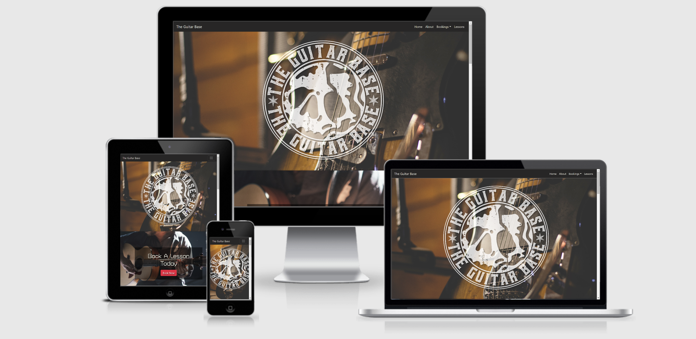

# The Guitar Base

    The Guitar Base is a site designed to make guitar lessons look easy and doable. We believe that learning guitar 
    should be a pleasant journey and something that should be enjoyed. Potential clients will be able to feel like playing 
    guitar is achievable and not tedious and mundane.

    Once people have browsed over the pages and read our info the will then be able to book a lesson of their choosing
    by filling in the booking form which all the links will guide them too.

## UX

 1. As a user I want an easy site to navigate so i can explore the site.
 2. AS a user I want to feel good when looking at the site.
 3. As a user I want to know what the site is about.
 4. As a user I want to be made to feel i can achieve playing the guitar by taking their lessons.
 5. As a user I want to easily navigate to where i can make a booking.
 6. As a user I want to feel happy about starting my guitar journey.

 [Mobile First Design](documentation/wireframes/mobile-first-design.png)

 [Home Page](documentation/wireframes/home-page.png)

 [About Page](documentation/wireframes/about-page.png)

 [Lessons Page](documentation/wireframes/lessons-page.png)

 [Successfull Booking Page](documentation/wireframes/successful-booking-page.png)

 ### Colours and Typography:
    
  - I decided on an off white for the font colouring as i found it added to the laid back 
    and cool feel of the site.

  - I used "Turret Road" with sans-serif as a fall back for my font-family. I found this style
    to suit the vibe if the site.

## Features 

#### Mobile First Design 

 - Expandable menu with header as link
 - Custom logo over hero image 
 - Various pictures of people playing guitars
 - Booking buttons that link to booking form on lessons page
 - Various paragraphs about the site and sites mentality
 - Footer with rotating social links 

#### Home Page 

 - Header with links to all pages and lesson select that links to booking 
   form on lesson page
 - Hero image with custom logo for The Guitar Base
 - Parallax scrolling effect 
 - Booking buttons with link to booking form on lessons page 
 - Various pictures of people playing guitars 
 - Various paragraphs about the site and sites mentality
 - Footer with rotating social links 
 
#### About Page 

 - Header with links to all pages and lesson select that links to booking 
   form on lesson page
 - Hero image with paragrapg about The Guitar Base
 - Parallax scrolling effect 
 - Booking buttons with link to booking form on lessons page 
 - Video of guitarist playing a song 
 - Various pictures of people playing guitars 
 - Footer with rotating social links 

#### Lessons Page 

 - Header with links to all pages and lesson select that links to booking 
   form on lesson page
 - Form to fill in info to contact site  
 - Hero image with booking form that all links lead to 
 - 3 sets of 2 pictures of guitar players each representing lesson type
 - Styles of lessons rotating 
 - Booking buttons for each lesson type
 - Footer with rotating social links 

 #### Successful Booking Page

  - Header with links to all pages
  - hero image
  - text to confirm booking
  - Button to return to home screen

#### Existing Features 

 - Header and custom logo
 - Navagation bar
 - Parallax scrolling
 - Footer with rotating social links
 - Video link to youtube
 - Home page
 - About page
 - Lessons page
 - Successful booking page with return to home button

 #### Future features i want add
 
 - One on one live video tutorials
 - Live Q & A
 - Downloadable backing tracks to jam to
 - Videos of students making propress

 ## Technologies used

 - HTML5
 - CSS
 - Github and Gitpod
 - Bootstrap 4
 - Js ans Jquery cdn with Bootstrap
 - Googlefonts
 - Font Awesome
 - Youtube

## Testing

Testing documentation can be found [Here](documentation/Testing.md)

## Deployment 

- The published site can be found on gitpages [The Guitar Base](https://slidytights.github.io/The-Guitar-Base-MS1/)
- All code was written on Git Hub
- I then pushed the code to Github [Repository](https://github.com/Slidytights/The-Guitar-Base-MS1)
- In the settings i selected master to get my published site address
- The code can be run locally or downloaded from the Repository page

## Credits

 - Navbar and drop down menu from Whiskey drop project and Bootstrap
 - Help with ideas on how to code certain things i got from Stack Overflow and W3 Schools
 - Youtube for Videos
 - all pictures are from UnSplash.com
 - All icons are from Font Awesome
 - All fonts are from Google Fonts
 - Custom Logo from friend Steven Mawhinney

 ## Acknowledgements

  - My mentor Narender Singh for his guidance and Help
  - CI staff and Slack community for being there to answer any questions or help me if i was stuck
  - Jim Morel from slack for looking over my site as a third party for constructive critisim